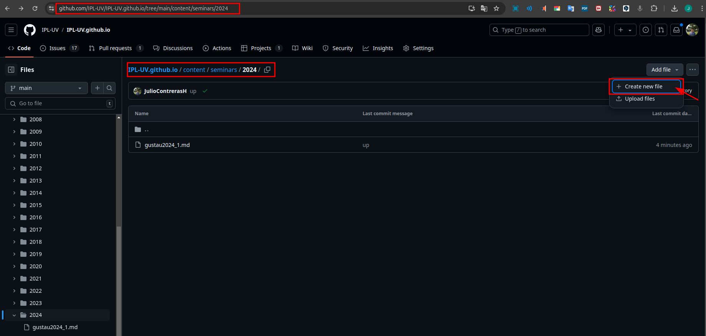
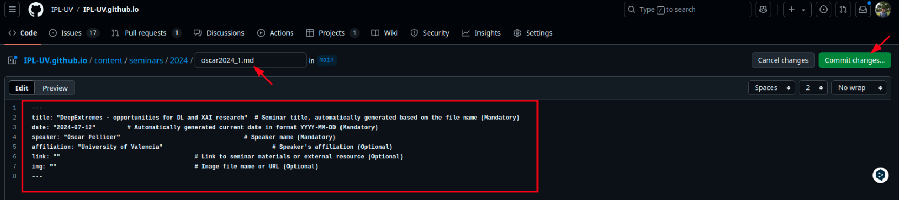
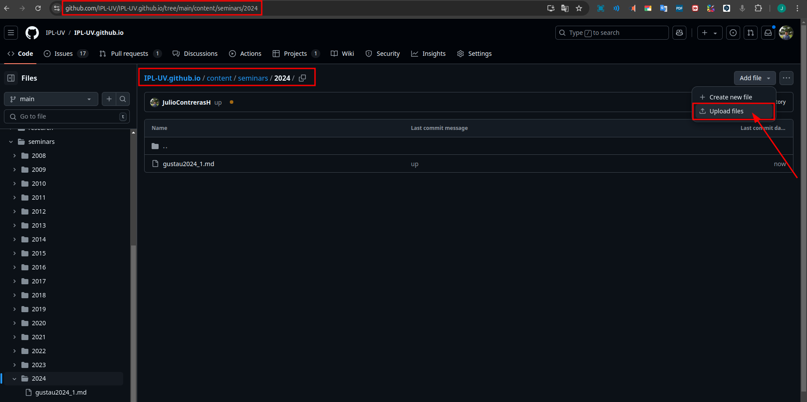
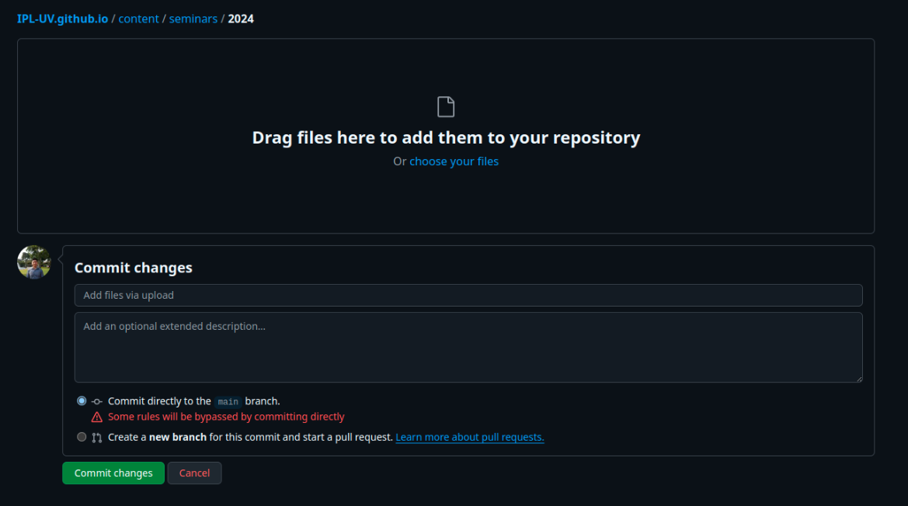
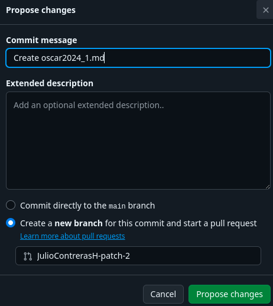

# **Welcome to the ISP Web Development Guide** 👨‍💻🌐

You are now part of the ISP team! Here's a quick journey to help you understand how to contribute to the ISP website.

# **Table of Contents**

- [**Welcome to the ISP Web Development Guide** 👨‍💻🌐](#welcome-to-the-isp-web-development-guide-)
- [**Step 1: 🚀 Getting Started with the Repository**](#step-1--getting-started-with-the-repository)
  - [**Option 1: Terminal Approach**](#option-1-terminal-approach)
  - [**Option 2: Using GitKraken 🐙**](#option-2-using-gitkraken-)
  - [**Option 3: Using GitHub Web Interface 🖥️**](#option-3-using-github-web-interface-%EF%B8%8F)
- [**Step 2: 🔧 Making Your Changes**](#step-2--making-your-changes)
  - [**Adding a New Person (People page) 🧑‍🏫**](#adding-a-new-person-people-page-)
  - [**Adding a New Project (Project page) 📝**](#adding-a-new-project-project-page-)
  - [**Adding a New Course (Courses page) 📚**](#adding-a-new-course-courses-page-)
  - [**Adding a New Facility (Facilities page) 🏢**](#adding-a-new-facility-facilities-page-)
  - [**Adding a New News Article (News page) 📰**](#adding-a-new-news-article-news-page-)
  - [**Adding a New Seminar (Seminars page) 🎤**](#adding-a-new-seminar-seminars-page-)
- [**Step 3: Adding Images to Assets**](#step-3-adding-images-to-assets)
- [**Step 4: 👀 Testing Your Changes Locally**](#step-4-👀-testing-your-changes-locally)
- [**Step 5: ✅ Pushing Your Changes**](#step-5--pushing-your-changes)
- [**Final Words 🌟**](#final-words-)
- [**Working Directly on GitHub**](#working-directly-on-github)
- [**Pull Requests: Why They're Important 💡**](#pull-requests-why-theyre-important-)


## **Step 1: 🚀 Getting Started with the Repository**

Before you dive into the code, it's important to know that there are **multiple ways to manage Git repositories**. The most common approach is using Git commands in the terminal, but you can also use **Git GUI tools** like **GitKraken**, which makes it easier to manage repositories visually. GitKraken is a Git client that helps you work with repositories on **GitHub**, **GitLab**, and other platforms. 


### **Option 1: Terminal Approach**

If you prefer working with the command line, follow these steps to clone the repository and create a new branch:


```bash
git clone https://github.com/IPL-UV/IPL-UV.github.io
```
If you'd like to keep a copy of the repository in your own GitHub account for independent work, you can fork the repository first. Forking creates a personal copy of the repository on your account:

1. Go to the [ISP-UV GitHub Repo](https://github.com/IPL-UV/IPL-UV.github.io).
2. Click the Fork button in the top-right corner.
3. After forking, clone your copy:

```bash
git clone https://github.com/YOUR-USERNAME/IPL-UV.github.io
```

Now that you have a copy of the repo, let's create a branch for your new page. It's always good practice to create a new branch with a descriptive name. Let's say you're adding a new visitor:

```bash
git switch -c adding-visitor-jose
```
This keeps your changes isolated until you're ready to merge them into the main branch. Always name your branches descriptively to help others understand what you're working on.

### **Option 2: Using GitKraken 🐙**

If you're not comfortable with the command line, or if you just want a more visual way to manage repositories, you can use GitKraken. This tool allows you to perform all Git operations (like cloning, branching, and committing) without writing commands.

With GitKraken, you can:

- Clone the repository visually by providing the URL.
- Create new branches with just a few clicks.
- Stage, commit, and push your changes with an intuitive interface.
- Visualize the entire Git history and manage conflicts easily.

Using GitKraken or similar tools can make Git operations more beginner-friendly and less prone to mistakes.


### **Option 3: Using GitHub Web Interface 🖥️**

If you're looking for a quick and easy way to add or edit `.md` files without using the terminal or a Git GUI tool, you can do it directly on GitHub. This method is especially useful for minor changes or additions.

**Step 1: Navigate to the Repository**

1. Go to the [ISP-UV GitHub Repo](https://github.com/IPL-UV/IPL-UV.github.io).
2. Use the directory structure to find the folder where you want to add or edit the `.md` file. For example, if you're adding a seminar for 2024, navigate to the `content/seminars/2024` folder.


**Step 2: Adding or Editing Files**

- **Adding a New File**:
    1. Once you're in the desired folder, click the `Add File` button in the top-right corner.
    2. Choose `Create new file` to start writing a new `.md` file.
    3. Give the file a descriptive name, such as `seminar2024.md`.
    4. Write the content for your file following the necessary format (e.g., the seminar template).
    5. Once finished, scroll down to the "Commit changes" section.
    6. You can commit directly to the `main` branch or create a new branch for review (recommended for larger changes).

<p align="center">
  
</p>

<p align="center">
  
</p>

- **Uploading a New File**:
    1. Once you're in the desired folder, click the `Add File` button in the top-right corner.
    2. Choose `Upload files` from the dropdown menu.
    3. In the next screen, drag and drop your `.md` file into the designated area or click "choose your files" to browse and upload the file from your computer.
    4. After uploading, you'll see the "Commit changes" section at the bottom of the screen.
    5. Add a descriptive commit message explaining what the new file is about.
    6. Choose whether to:
       - **Commit directly** to the `main` branch (if it's a minor change or if you're confident with it).
       - **Create a new branch** for the changes and open a pull request for review (recommended for larger changes).
    7. Click `Commit changes` or `Propose changes` depending on your selection.


<p align="center">
  
</p>

<p align="center">
  
</p>


**Step 3: Committing Your Changes**

1. Add a descriptive commit message to explain what you've changed or added.
2. Choose whether to:
   - **Commit directly** to the `main` branch (if you're confident in your changes and they are minor).
   - **Create a new branch** and open a pull request for review (recommended for larger changes or new content).

3. Once the changes are committed, they will be reflected in the repository. If you've created a pull request, wait for it to be reviewed and merged into the main branch.

This method is simple and doesn't require any local setup, making it perfect for quick edits or minor content additions directly through the GitHub interface!

<p align="center">
  
</p>


## **Step 2: 🔧 Making Your Changes**

Great! Now you're ready to make changes. Here’s how you can add new content to the website. Whether it's for people, projects, or courses, the process is similar.


### **Adding a New Person (People page) 🧑‍🏫**

Let's start with adding a new person to the People section.

First, use Hugo’s archetype to generate the necessary markdown file:


```bash
hugo new content/people/dir_role/nameofperson.md  # Be sure to choose the correct role for dir_role!
```

This will create a new `.md` file in the `content/people/dir_role` directory.

Here are the available options for `dir_role`:

- alumni
- assistant_professors
- associate_professors
- full_professors
- phd_students
- postdocs
- senior_research_scientists
- visitors

Once you’ve created the file, edit the following:

1. Open the file and update the front matter:
    - `title`: The person’s name.
    - `role`: The role (e.g., postdocs, visitors, full professors).
2. Add the person's photo to `assets/images/people/`.

Once the information is complete, Hugo will take care of the layout when the site is built.


Here is the archetype template that will be used for people:

```yaml
---
title: "{{ replace .Name "-" " " | title }}"  # Name of person: automatically generated title based on the file name (Mandatory)
role: ""  # Role of the person (e.g., full professors, postdocs, etc.) (Mandatory)
weight: 0  # Used to set the order of appearance (Optional)
params:
  img: ""  # Image file name (located in /images/people/) (Mandatory)
  googlescholar: ""  # Google Scholar profile link (Optional)
  orcid: ""  # ORCID profile link (Optional)
  twitter: ""  # Twitter profile link (Optional)
  github: ""  # GitHub profile link (Optional)
  semanticscholar: ""  # Semantic Scholar profile link (Optional)
  researchgate: ""  # ResearchGate profile link (Optional)
  uv: ""  # University of Valencia profile link (Optional)
  linkedin: ""  # LinkedIn profile link (Optional)
  ieee: ""  # IEEE profile link (Optional)
  dblp: ""  # DBLP profile link (Optional)
  academia: ""  # Academia.edu profile link (Optional)
  scopus: ""  # Scopus profile link (Optional)
  website: ""  # Personal website link (Optional)
  link_image: ""  # Optional: link to an external image or profile
---

Add the person's biography or description here
```


### **Adding a New Project (Project page) 📝**

Let's start with adding a new project to the Projects section.

First, use Hugo’s archetype to generate the necessary markdown file:

```bash
hugo new content/projects/current/name_of_project.md  # Create new projects in the "current" directory!
```

This will create a new `.md` file in the `content/projects/current` directory.

Here are the available options for where to create new projects:

- current: For ongoing projects.
- past: For completed projects.

**Note:** The folders like `ai4cs` or others contain additional content related to specific projects and are not meant for creating new project entries. Stick to the `current` and `past` folders for adding new projects.


Once you’ve created the file, follow these steps:

1. Open the file and update the front matter:
    - `title`: The project's name.
    - `logo`: Filename of the project logo (located in `/assets/images/projects/`).
    - `pi`: Principal Investigator(s).
    - `uvpi`: University of Valencia Principal Investigator(s).
    - `years`: Duration of the project (e.g., "2020-2023").
    - `website`: Official project website URL.
2. Add the project's logo to `assets/images/projects/`.

Once the information is complete, Hugo will take care of the layout when the site is built.

Here is the archetype template that will be used for projects:

```yaml
---
title: "{{ replace .Name "-" " " | title }}"  # Project title (Mandatory)
logo: ''  # Logo filename (e.g., 'project-logo.png') (Mandatory)
pi: ''  # Principal Investigator (PI) name(s) (Optional)
uvpi: ''  # University of Valencia Principal Investigator (UV-PI) name(s) (Optional)
years: ''  # Project duration (e.g., '2020-' or '2020-2023') (Optional)
website: ''  # Official project website URL (Mandatory)
funding_source: ''  # Source of funding (e.g., 'EU Horizon 2020') (Optional)
role: ''  # Role of the University in the project (Optional)
project_type: ''  # Type of project (e.g., 'Research Program', 'Collaboration') (Optional)
partners: []  # List of partner institutions (e.g., ['Institution 1', 'Institution 2']) (Optional)
weight: 0  # Weight for ordering projects (lower numbers appear first) (Optional)
---
```


### **Adding a New Course (Courses page) 📚**

Let’s start with adding a new course to the Courses section.

First, use Hugo’s archetype to generate the necessary markdown file:

```bash
hugo new content/courses/name_of_course.md  # This will create a new course in the "courses" directory
```

This will create a new `.md` file in the `content/courses/` directory, where all course files are stored.

Once you’ve created the file, follow these steps:

1. Open the file and update the front matter:
    - title: The course title.
    - img: Image file for the course (located in `/assets/images/courses/`).
    - link: URL to the course material or resource.
    - course_duration: Duration of the course (e.g., "30 hours").
    - instructor: Name(s) of the instructor(s).
2. Add the course image to `assets/images/courses/`.

Once the information is complete, Hugo will take care of the layout when the site is built.

Here is the archetype template that will be used for courses:

```yaml
---
title: "{{ replace .Name "-" " " | title }}"   # Course title (Mandatory)
img: ""                                        # Image file name (located in /images/courses/) (Mandatory)
link: ""                                       # Link to course material or external resource (Mandatory)
course_duration: ""                            # Duration of the course (e.g., '30 hours') (Optional)
instructor: ""                                 # Instructor(s) of the course (Optional)
---

Add the course description here
```

### **Adding a New Facility (Facilities page) 🏢**

Let’s start with adding a new facility to the Facilities section.

First, use Hugo’s archetype to generate the necessary markdown file:

```bash
hugo new content/facilities/name_of_facility.md  # This will create a new facility in the "facilities" directory
```

This will create a new `.md` file in the `content/facilities/` directory, where all facility entries are stored.


Once you’ve created the file, follow these steps:

1. Open the file and update the front matter:
    - `title`: The facility name.
    - `img`: Image file for the facility (located in `/assets/images/facilities/`).
    - `link`: URL to the facility details or an external resource (if applicable).
2. Add the facility image to `assets/images/facilities/`.

Once the information is complete, Hugo will take care of the layout when the site is built.

Here is the archetype template that will be used for facilities:

```yaml
---
title: "{{ replace .Name "-" " " | title }}"  # Facility title (Mandatory)
img: ""                                       # Image file name (located in /images/facilities/) (Mandatory)
link: ""                                      # Link to facility details or external resource (Optional)
---

Add the facility description here
```


### **Adding a New News Article (News page) 📰**

Let’s start with adding a new news article to the News section.

Each news entry is organized by year, as shown in the directory structure. When adding news articles, make sure to place them in the appropriate folder based on the year of publication. For example, articles published in 2024 should go in the `2024` folder.

Here’s how to generate a new news file:

```bash
hugo new content/news/2024/title-of-news.md  # This will create a new news article in the "2024" folder
```

This will create a new `.md` file in the `content/news/2024/` directory. Adjust the year in the path based on the publication year of the news item.

Once you’ve created the file, follow these steps:

1. Open the file and update the front matter:
    - `title`: The news title, automatically generated from the file name.
    - `date`: Automatically set to the current date (or adjust it if needed).
    - `link`: Optional link to the full news article.
    - `img`: Image file for the news (located in `/assets/images/news/` or a full URL).
2. Add the news image to `assets/images/news/`.

Once the information is complete, Hugo will take care of the layout when the site is built.

```yaml
---
title: "{{ replace .Name "-" " " | title }}"  # News title, automatically generated based on the file name (Mandatory)
date: "{{ now.Format "2006-01-02" }}"         # Automatically generated current date in format YYYY-MM-DD (Mandatory)
link: ""                                      # Link to the full news article (Optional)
img: ""                                       # Image file name or URL (Mandatory)
---

Add the news content here
```

### **Adding a New Seminar (Seminars page) 🎤**

Let’s start with adding a new seminar to the Seminars section.

Each seminar is organized by year, as shown in the directory structure. When adding seminars, make sure to place them in the appropriate folder based on the year of the event. For example, seminars in 2024 should be placed in the `2024` folder.

Here’s how to generate a new seminar file:

```bash
hugo new content/seminars/2024/title-of-seminar.md  # This will create a new seminar in the "2024" folder
```

This will create a new `.md` file in the `content/seminars/2024/` directory. Adjust the year in the path based on the seminar's event date.

Once you’ve created the file, follow these steps:

1. Open the file and update the front matter:
    - `title`: The seminar title, automatically generated from the file name.
    - `date`: Automatically set to the current date (or adjust it if needed).
    - `speaker`: Name of the speaker.
    - `affiliation`: Speaker's affiliation (optional).
    - `link`: Optional link to seminar materials or an external resource.
    - `img`: Image file for the seminar (located in `/assets/images/seminars/` or a full URL).
2. Add the seminar image to `assets/images/seminars/` if applicable.

Once the information is complete, Hugo will take care of the layout when the site is built.

Here is the archetype template that will be used for seminars:

```yaml
---
title: "{{ replace .Name "-" " " | title }}"  # Seminar title, automatically generated based on the file name (Mandatory)
date: "{{ now.Format "2006-01-02" }}"         # Automatically generated current date in format YYYY-MM-DD (Mandatory)
speaker: ""                                   # Speaker name (Mandatory)
affiliation: ""                               # Speaker's affiliation (Optional)
link: ""                                      # Link to seminar materials or external resource (Optional)
img: ""                                       # Image file name or URL (Optional)
---
```


### **Step 3: Adding Images to Assets**

Whenever you want to add new images to the site, place them in the appropriate directory under `assets/images/`. The folder structure in `assets/images/` should match the name of the main sections of the website (e.g., people, projects, etc.). Images should preferably be in `.webp` format for better performance.

You don’t need to provide the full path when referencing images in the content. Just specify the image file name and its extension.

## **Step 4: 👀 Testing Your Changes Locally**

Before submitting your changes, it’s a good idea to test them locally.

To do this, you need to have Hugo installed. If you don’t have it yet, follow the [Hugo installation guide](https://gohugo.io/installation/).


Once Hugo is set up, you can start the local server with:

```bash
hugo server
```

Open a browser and go to `http://localhost:1313` to see your changes live!

## **Step 5: ✅ Pushing Your Changes**

If everything looks good, it’s time to push your changes and submit a pull request.

1. Stage your changes:
```bash
git add .
```

2. Commit your changes with a descriptive message:
```bash
git commit -m "Added new visitor: Jose"
```

3. Push your branch:
```bash
git push origin adding-visitor-jose
```
Now head over to GitHub and open a pull request (PR) for your branch. Once your PR is approved and merged, your changes will be live on the website! 🎉


# **Final Words 🌟**

And that's it! You've just learned how to contribute to the ISP website. Whether you're adding new people, projects, or courses, this guide should give you everything you need to get started.

Happy coding, and welcome to the team! 🥳


---

# Working Directly on GitHub

Another simple approach to working with the ISP website is editing files directly on GitHub. This method is especially useful for quick changes, like editing text or adding new content, without having to clone the entire repository or set up a local development environment.

To edit or add a new file:

1. Navigate to the repository on GitHub: ISP-UV GitHub Repo.
2. Go to the directory where you'd like to make changes.
3. Click on the file you want to edit or the Add File button to create a new one.
4. Once you're done, click Commit changes and optionally start a pull request.

This method is fast and doesn't require installing any programs, but it’s best suited for small edits.


# Pull Requests: Why They're Important 💡
Once you've made changes in your branch, whether locally or directly on GitHub, the next step is to create a pull request (PR).

A pull request is a way to notify other collaborators that you're ready to merge your changes into the main project. It also gives others the opportunity to review and discuss your code before it gets merged. This is essential in ensuring that:

- Changes are properly tested.
- There are no conflicts with other parts of the project.
- The quality of the project remains consistent.

When you push your branch to GitHub, you’ll be prompted to create a pull request:

```bash
git push origin adding-visitor-jose
```

Then, on GitHub, navigate to the Pull Requests tab and open a new PR.

**💬 Pro Tip:** Pull requests are also a great place to ask questions, point out issues, or request feedback from your team members!


<!-- | page          | hugo layout         | content            |             
|---------------|---------------------|--------------------|
| Landing page  | :white_check_mark:  | :white_check_mark: |
| People page   | :white_check_mark:  | :question:         |
| Research pages| :white_check_mark:  | :question:         |
| Projects      | :white_check_mark:                 | :x:                |
| Facilities    | :x:                 | :x:                |
| Publications  | :white_check_mark:  | :question:         |
| Code          | :x:                 | :x:                |
| Data          | :x:                 | :x:                |
| Seminars      | :x:                 | :x:                |
| Courses       | :x:                 | :x:                |
| News          | :x:                 | :x:                |
| Contact       | :x:                 | :x:                |  -->
