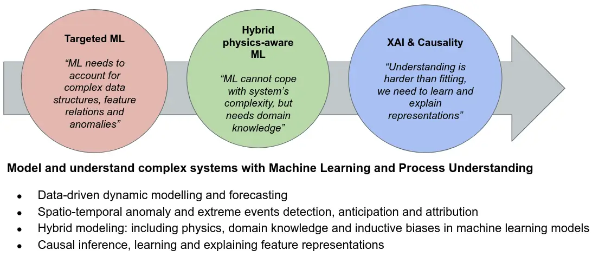

# Machine learning

   

## Motivation

**Machines may extract knowledge from measurements by analyzing the statistical properties of the acquired signals.** The aim is to capture the structures in the experimental data. Our contributions to machine learning include algorithms for automatic classification (recognition) of objects, robust regression tools for multidimensional data, density estimation algorithms, and feature extraction and selection. We study the principled design of learning algorithms, specially neural networks and kernel methods. **Methods are designed for general purposes but also specific to the application, most of them related to image processing, computer vision tasks and Earth science data analysis, but also non-structured data in social sciences.**

## An AI agenda

**The main research hypothesis of our research agenda is that current AI models are limited to tackle fitting problems only, and do not have a clear notion of space, time and causal relations.** We need to aboard the more ambitious questions of understanding through machine learning, going beyond mere model fitting. This goal needs to develop (i) targeted ML that respects data characteristics, (ii) hybrid physics-aware ML that incorporates domain knowledge and inductive priors, and more importantly (3) moving from fitting to understanding through AI models that are explainable and grasp causal relations from observational data.

</img>
 

**In order to advance in the previous AI agenda, we base our research in 3 fundamental research pillars:**

- **Pillar 1. Targeted AI.** We developed advanced model inversion that account for the particular data characteristics (nonstationariety, non-Gaussianity, non-linearity), specifically designed to deal with (un)structured data, and focus on modeling and understanding a system through data-driven characterization of system's behaviour (memory, bifurcation, stability).
- **Pillar 2. Physics-aware modeling, inductive biases and domain knowledge in machine learning.** Our activities here encompass developing algorithms that live in the Physics and machine learning interplay: both through encoding (hybrid machine learning models) and decoding (discovery principles and physical laws from data).
- **Pillar 3. Explainable AI and Causality.** Scientific consistency, reliability, and explainability of obtained results are of paramount importance in complex systems. A prerequisite to achieve those is to design ML models that cannot be challenged, or whose inner functioning can be visualized, queried or interpreted. We aim to achieve transparency, interpretability and explainability of models to achieve a wider adoption and confidence by domain scientists. Yet, ML model interpretability is not enough because model development already assumes a causal relation, the real far-end goal of learning with machines.

## Challenges and approaches

**The group has a relatively long tradition in machine learning, particularly focused on the study and development of neural networks and kernel machines.** Recently, the fields of manifold, semisupervised and active learning have captured our attention. The study of the intrinsic coordinates and representations where data in general, and images in particular, live is interesting for many applications. Regression and classification methods must be modified to deal with changes in data/image statistics efficiently. **In many signal and image processing problems, such as change detection or multitemporal data classification, adaptation is a must. We currently model shifts, twists and wrappings of image distributions by designing semisupervised learning methods. The fields of manifold alignment and domain adaptation has also important information-theoretic implications which we analyzed through kernel entropy component analyis, multivariate Gaussianization transforms and extensions of principal curves and surfaces. And yes, deep learning is of interest to us; what has the networked learned? and why?** Follow our works in [Papers](papers.html).

Purely supervised methods work very well in static environments and when representative experimental data are observed. If this does not happen, algorithms may fail because data structured has not been accurately captured and modeled. We are also interested in complementary fields that arise under such circumstances: **active learning**, which tries to select the most informative samples to improve algorithm's performance, and semisupervised learning, which is focused on exploiting the wealth of unlabeled data to improve performance. Semisupervised learning typically resorts to modeling data distributions whose characteristics are then imposed to the signal model. This is a very challenging problem that is directly related to **density estimation** (since one ultimately seeks for a proper model of the marginal data density) and **manifold learning** (since the intrinsic data coordinates need to be found for data characterization).

While supervised learning is already equipped with an efficient toolbox of methods, unsupervised learning (clustering) is far from being a solved problem. The goal here is to identify and characterize clusters that truly represent data structure (e.g. identifying the independent components). Meaningful data representations (or efficient feature extraction) and accurate **probability density function (PDF) estimations** are the key to solve a variety of Image and Signal processing problems, as well as to **understand the behavior of the visual brain from a statistical point of view**. We focus on looking for efficient non-linear transforms for data representation: note that feature extraction is just a form of non-linear sensor design. Our research has followed different alternative directions.

Modeling input data, however, does not ensure that the model will adapt to changing environments. Imagine the same scene under different illuminations or an exchange rate time series under different economical situations. These specific problems are known under different names: **transfer learning, domain adaptation, and adaptive learning**. The field is very active nowadays, especially because incredibly huge amounts of data streams are being acquired (satellite images, internet videos, photos, etc) and need to be analyzed. We tackle these problems with kernel methods, trying to accommodate data shifts in the notion of similarity, or by defining proper signal models in reproducing kernel Hilbert spaces.

**Sparsity as a form of compacting information was studied in both deep architectures and kernel machines.** In all these settings, we are particularly interested in **encoding prior knowledge and invariances** in the models: signal and noise properties, spatial-temporal constraints, amd robustness to illumination changes, just to name a few. Dealing with invariances and priors inmediately call for **regularization and Bayesian inference**. While pure discriminative approaches have been developed in our group, in recent years we have payed attention to the field of Bayesian nonparametric models as a proper framework to encode such beliefs. We are active in kernel design for **Gaussian processes regression and model inversion, and in designing efficient sampling schemes with modern Markov Chain Montecarlo strategies**.

