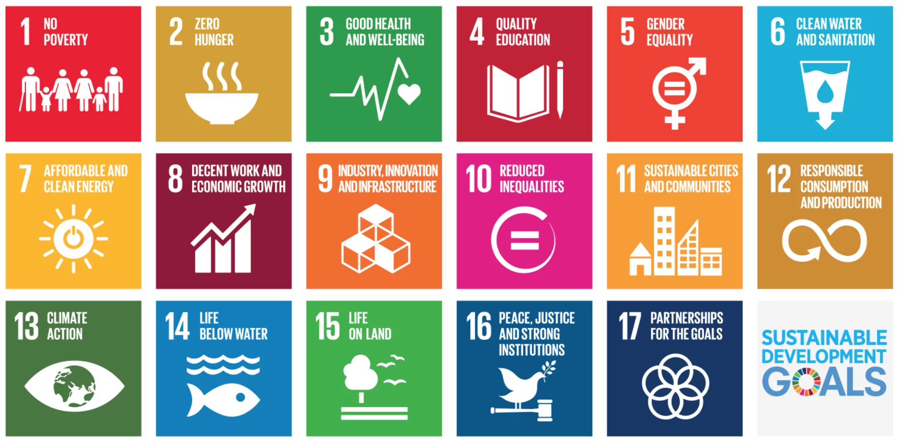

# AI for sustainability and social sciences

 

## Motivation

**The Earth is a highly complex, dynamic, and networked system where very different physical, chemical and biological processes interact, to form the world we know. The description of such a complex system needs of the integration of different disciplines such as Physics, Chemistry, Mathematics and other applied sciences, leading to what has been coined as Earth System Science (ESS). The analysis of the Earth system involves studying interacting processes occurring in several spheres (atmosphere, hydrosphere, cryosphere, geosphere, pedosphere, biosphere, and magnetosphere) as well as the anthroposphere where the Society acts.**

</img>
 

Earth system science provides the physical basis of the world we live in, with the final objective of obtaining a sustainable development of our society, see the United Nations [Sustainable Development Goals](https://sustainabledevelopment.un.org/). We develop AI models for tackling pressing questions in the climate-society interplay. We tackle problems where the human is in the middle (both a cause and an effect); where SDGs, fairness and ethics are implied, and where elusive concepts like wealth, well-being and development are involved. Our unique approach involves exploiting massive amount of data and machine learning algorithms to model and understand the environment-human interactions.

## Challenges and approaches

Our main goal is to develop new machine learning models for the efficient treatment of biophysical land parameters and related covariates at local and global scales. This main scientific goal translates into the following objectives:

- **AI for Sustainable Development Goals.** The synergistic combination of deep learning models and Earth observation promises significant advances to support the sustainable development goals (SDGs). Among the main goals and potential applications, we focus on crop monitoring. Monitoring agricultural land use and production is essential to achieve zero hunger (SDG 2). It is of high importance for food production, biodiversity, and forestry. An increasing world population, climate change, and changes in food consumption habits put yet uncultivated areas under pressure, while leading to intensification in existing agricultural areas. We rely on spatio-temporal bi-LSTM deep nets to fully exploit information of long time series of high-resolution Sentinel-2 data to classify different crop types, as well as on eXplainable AI (XAI) models based on neural networks and Gaussian processes for the crop yield estimation at different continental and global scales

- **The principal axis of development.** What do you mean by `development?'. We explored the question with data and (agnostic) machine learning. Using a nonlinear dimensionality reduction approach we extracted the core dimensions of development in a highly efficient way. We have found that more than 90% of variance in the WDIs can be represented by solely five uncorrelated dimensions. The first dimension, explaining 74% of variance, represents the state of education, health, income, infrastructure, trade, population, and pollution. Although this dimension resembles the HDI, it explains much more variance. The second dimension (explaining 10% of variance) differentiates countries by gender ratios, labor market, and energy production patterns. Here, we differentiate societal structures when comparing e.g. countries from the Middle-East to the Post-Soviet area. Our analysis confirmed that most countries show rather consistent temporal trends towards wealthier and aging societies. We can also find deviations from the long-term trajectories during warfare, environmental disasters, or fundamental political changes. The data-driven nature of the extracted dimensions complements classical indicator approaches, allowing a broader exploration of global development space. The extracted independent dimensions represent different aspects of development that need to be considered when proposing new metric indices.

- **Algorithmic Fairness.** New social and economic activities massively exploit big data and machine learning algorithms to do inference on people's lives. Applications include automatic curricula evaluation, wage determination, and risk assessment for credits and loans. Recently, many governments and institutions have raised concerns about the lack of fairness, equity and ethics in machine learning to treat these problems. It has been shown that not including sensitive features that bias fairness, such as gender or race, is not enough to mitigate the discrimination when other related features are included (SDGs 5 and 10). Instead, including fairness in the objective function has been shown to be more efficient. We develop novel fair regression and dimensionality reduction methods to tackle such problems. The proposed methods allow us to tackle pressing societal problems like predicting income using gender and/or race discrimination as sensitive variables, contraceptive method prediction under demographic and socio-economic sensitive descriptors, or predicting climate change protecting against anthropogenic factors. Neural networks, Gaussian processes, kernel machines and optimal transport are our favourite tools.

- **Causality in the biosphere-anthroposphere coupled system.** The terrestrial biosphere and the anthroposphere are deeply coupled in multiple ways. Humans depend on a range of ecosystem goods and services but, at the same time, they heavily engineer and modify land ecosystems. Over the past decades, human development has generally made substantial progress in terms of education (SDG 2), health services (SDG 2), life expectancy (SDG 2) and many other aspects around the planet with very few exceptions due to e.g. warfare and in sub-Saharan Africa. The grand question is if, and how, one can identify and quantify relationships between changes in land-ecosystem states and the human development metrics at the global scale. We tackle problems of food insecurity (SDGs 1, 2), climate-induced migration (SDGs 1, 2), infants well-being (SDGs 3, 4) and conflicts (SDGs 10, 11). Our hypothesis is that we can now tackle causal discovery problems relying on both assumed relations and exploiting observational data. We rely on the science of causal inference to unravel relations between coupled variables beyond correlations even in the presence of non-linearities and non-stationarities.

### Related projects

  <table class="table table-hover">
    <tr>
        <th style="width: 10%">
            
        </th>
        <th style="width: 90%">
            <a href="https://www.fbbva.es/noticias/concedidas-5-ayudas-a-equipos-de-investigacion-cientifica-en-big-data/">SCALE: Causal inference in the human-biosphere coupled system (SCALE)</a> 
            Fundación BBVA, G. Camps-Valls, 2020-2022
        </th>
    </tr>
    <tr>
        <th style="width: 10%">
            
        </th>
        <th style="width: 90%">
            <a href="https://xaida.eu">XAIDA: Extreme Events - Artificial Intelligence for Detection and Attribution</a> 
            EU H2020, UV PI: Gustau Camps-Valls, 2021-2025
        </th>
    </tr>
    <tr>
        <th style="width: 10%">
            
        </th>
        <th style="width: 90%">
            <a href="https://deepcube-h2020.eu">DeepCube: Explainable AI pipelines for big Copernicus data, UV PI: Gustau Camps-Valls</a> 
            EU H2020, 2021-2024
        </th>
    </tr>
    <tr>
        <th style="width: 10%">
            
        </th>
        <th style="width: 90%">
            <a href="http://www.citizensensor-cost.eu">Mapping and the citizen sensor</a> 
            ICT COST Action, 01/13 - 12/16
        </th>
    </tr>
</table>

   
   

